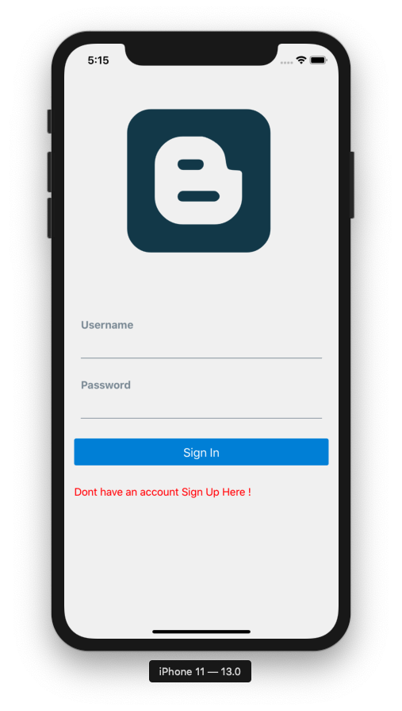
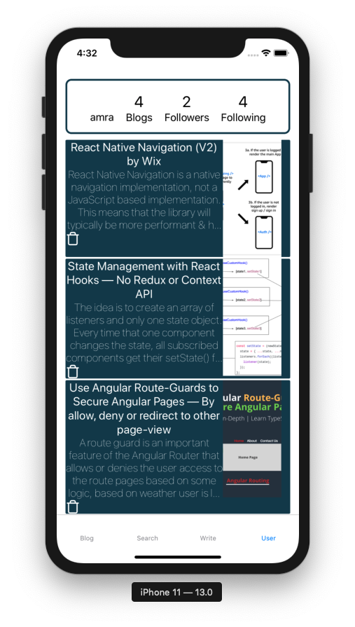

# README

# TechBox

A mobile application that allows users to write blogs, follow other users and read their blogs.

# Requirements

$ node --version
v13.10.1

$ npm --version
6.13.4

$ rails -v
6.0.2.1

# Quick Overview

First, clone/fork-clone the TechBox app. Once your inside of that repo run the following:

            cd blog-backend
            rails db:migrate && rails db:seed && rails db:start

This will automatically migrate the database,seed the data from the seed file and 
start the server on http://localhost://3000

Then run on another bash the following:

            cd blog-frontend
            npm install && npm start
        
This will run the app on exp://192.168.86.154:19000 and you can run the app  on iOS Stiumilator or Android Emulator.

# Languages and Frameworks

Utilized JSON Web Tokens and AsyncStorage to store encrypted user information with the JWT algorithm.
Used React and  React Native Library to create screen components and reusable components.
Implemented Context API for state management and Hooks.
Developed Rails API and PostgresSQL as a database to store user information and blog posts.

# Contribution

Pull requests are more than welcome. For major changes, please open an issue first to discuss what you would like to change.

This project does not have any tests.

This project was bootstrapped with EXPO.

 

